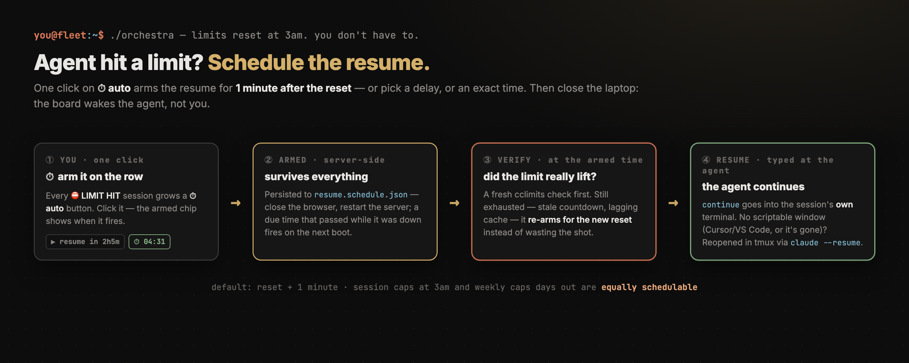

# orchestra ⌁

[](https://github.com/acrdlph/orchestra/actions/workflows/ci.yml)

**Mission control for parallel Claude Code agents — watch every worktree and
account on one board, chat with any agent, dispatch new missions, and land
finished ones.**


You're running Claude Code agents in five worktrees at once, across several
accounts. Which agent is working? Which one is waiting for an answer? Which
one silently hit a usage limit an hour ago? Which worktree is free for the
next feature — and on which account? orchestra answers all of it on one dark
board, and (when you click) acts on it too.

It's an agent **harness** that installs nothing — python3 stdlib only.

```bash
git clone https://github.com/acrdlph/orchestra && cd orchestra
python3 -m orchestra --root ~/code        # → http://127.0.0.1:4242
```

Try it with nothing running: `python3 -m orchestra --demo` serves fictional
data.

---

## The three views

A left rail navigates between them; all share one visual language:
**green = activity**, **orange = needs you**, **yellow = limit**,
**cyan = free**.

### ⌗ Board — who needs me, and where can I put the next agent?


One card per worktree, attention-sorted, refreshed every 5 s — and the
engine behind it re-reads the world within ~50 ms of an agent writing a line,
rather than on a timer. Each card:
branch, dirty count, ahead/behind, last commit, live processes, and every
recent session tagged with its **account**, model, age, and three lines of
context — `→` the last thing you told it, `⏎` the last thing it said, `⚙` the
latest subagent report. Session statuses:

| badge | meaning |
|---|---|
| `● WORKING` | transcript (or a subagent's) written < 90 s ago |
| `▲ NEEDS ANSWER` | live process with a pending question for you |
| `⛔ LIMIT HIT` | parked on an exhausted account — binding limit + reset countdown shown |
| `■ BLOCKED` | live process stuck on an unresolved tool call |
| `◆ YOUR TURN` | live process idle at the prompt — the turn is finished |
| `○ ENDED` | recent transcript, but no live process behind it |

The header names the **FREE worktrees** — no live process, nothing mid-turn —
so "where do I point the next agent?" is answered before you ask.

**Lost the window an agent runs in?** Each session carries its own terminal
chip with tty and hosting app (`⌖ 38627 ttys024 Terminal`); click it and that
window jumps to the front (AppleScript for Terminal.app/iTerm2; editors get
activated with a pointer to the tty; tmux agents get the attach command). The
chip sits on the session row, not the card, so a worktree running three agents
says which window is which — sessions are matched to processes by the account
each one runs under. A dashed chip means the pairing fell back to a guess.

**One door into the fleet — the 🚀 new mission button.** Instead of picking a
worktree, checking which account has usage left, opening a terminal, and
choosing a model by hand, you type what to build and orchestra routes it:


(Details in [Acting on the fleet](#acting-on-the-fleet) below.)

### ⌁ Map — where every branch really is


One trunk per repo (`origin/main`), and every worktree placed at its true git
position: branches leave the trunk at their real merge-base and run to their
tip on a **log time scale ending at "now"**; worktrees whose HEAD sits on main
ride the trunk at the exact commit they're parked on. A tip short of the right
edge is a branch that stopped moving; a long flat arc `↓137` behind is rebase
debt as literal distance. Dots are commits, tips take live status colors (a
working agent's tip pulses), hover for details, click a node for actions
(⌖ focus its terminal · ✓ finish the mission).

### ◔ Limits — is the agent stuck, or out of juice?


Every account side by side via [cclimits](https://github.com/acrdlph/cclimits):
headroom, per-limit usage bars, reset countdowns, ⛔ EXHAUSTED flags, and a
◇ MOST HEADROOM pick for your next agent. Exhausted accounts also feed back
into the board: their parked sessions flip to `⛔ LIMIT HIT` instead of
masquerading as "your turn" (the CLI's "out of usage credits" transcript
notice is a cache-independent fallback signal).

**Polling discipline:** limits are cached server-side for 5 minutes on top of
cclimits' own cache; a network refetch happens **only** when you click "force
refetch". Nothing polls the Anthropic API on a timer.

---

## Acting on the fleet

- **✉ chat** — every session opens a drawer: the conversation is read from
  the transcript; your reply is typed straight into the agent's terminal
  (tmux `send-keys`; AppleScript for Terminal.app/iTerm2 — grant the
  Automation permission when macOS asks; editor-embedded terminals are
  read-only). No more hunting windows to answer an agent.
- **▶ resume** — a session-limit-stuck agent gets a button with a live
  countdown that **arms itself the moment the limit resets**, then types
  `continue`. Weekly limits never show it — they won't heal soon.
- **⏱ auto** — or don't wait up for the reset at all: one click **schedules
  the resume** for 1 minute after the limit resets (the armed chip opens a
  drawer to pick another delay, an exact time, or disarm). At the armed
  moment the server re-checks the limit via cclimits — still exhausted →
  it re-arms for the fresh reset; clear → it types `continue` into the
  session's own terminal, and when no terminal can be scripted (Cursor/
  VS Code, or the window is gone) it reopens the conversation in a fleet
  tmux session via `claude --resume` and resumes it there. Schedules live
  in `resume.schedule.json`, so they survive a server restart — resets at
  3am and weekly limits days out are equally fine.

  
- **✓ finish** — one click, exactly as much closeout as is left: an unlanded
  branch gets the full closeout brief (typed at the live agent, or run by a
  one-shot closeout agent that frees the card by itself); an already-landed
  one gets a slim brief — or no agent at all: orchestra parks the worktree
  back on the trunk itself. A brief typed at a live agent flips the button
  to **✕ close** — the explicit second step that verifies the landing and
  exits the agent. See *Closing out a mission* below.
- **🚀 new mission** — describe a feature; orchestra picks the worktree and
  account **deterministically** — the cleanest free worktree, the account
  with the most headroom that can run your model — no AI in the routing loop,
  so the auto preview always names the worktree that actually launches, and
  a busy worktree can never be picked. It then launches a tmux-hosted agent:
  `tmux -L fleet attach -t mission-…` from any terminal, and it appears on
  the board like any other agent. **Your mission text is never rewritten** —
  the agent receives a deterministic operational header (branch, commit
  discipline) followed by the author's words verbatim, and names its own
  branch. Every dispatch is logged to `dispatch.log.jsonl` (gitignored) for
  auditing.
  **Model & effort are yours to pick** — judging a mission's difficulty is
  the one thing rules can't do, so nothing guesses it for you; the composer
  refuses to launch until both are chosen.
  Picking a model checks that model's *own* limit
  per account (Fable can be gone while the weekly limit is fine); if no
  account clears its reserve buffer for it, the dispatch pauses with a dialog
  offering **Opus** instead (or use it anyway) rather than launching blindly.
  Model is a launch flag; effort is typed as `/effort <level>`
  into the new session and **verified** via capture-pane (⚠ shown if
  unconfirmed). Caveat: the CLI saves non-ultracode effort levels as that
  account's default for new sessions — dispatching with an explicit effort
  updates that account's default too.

### Handoffs across accounts

The pattern that makes a multi-account fleet work:


An agent burns its account down, writes a handoff doc (drop to a cheaper model
for that), and an agent on a different account picks the branch up. orchestra
understands the succession: a limit-hit session with a fresher live session in
its worktree is annotated **"↳ work continued by [account] — this terminal can
be closed"**, leaves the need-you counts, and stops speaking for the branch on
the map. Only a stranded agent with *no* successor keeps demanding attention.

### Closing out a mission

One button: **✓ finish**, on every worktree card and in a map node's panel.
It arms on the first click, runs on the second, and — like everything
orchestra does — works by talking to a terminal:


- **agent alive** → it receives a closeout brief: land the branch on the
  trunk (merge, resolve, push), tidy the worktree, report back — and the
  button flips to **✕ close**, step two. Once the agent reports done,
  ✕ close verifies the landing and types `/exit`, closing the terminal;
  pressed early, it refuses and names what's still unverified — it never
  re-types the brief at an agent that may be mid-closeout. Merged to the
  trunk from the terminal yourself already? The brief shrinks to match —
  settle background work, tidy scratch, park on the trunk; nothing already
  merged is re-checked.
- **terminal already gone** → a one-shot closeout agent (headless
  `claude -p --model haiku` — the work is mechanical git, no judgment needed)
  runs the right-sized brief, then git itself verifies the landing: verified
  clean → the process ends and the card frees itself, no second click;
  anything else → the session reopens interactively **on the account's
  default model** (the resume is deliberately unpinned, so failure escalates
  past haiku) and the card parks as *needs you* — a failed closeout never
  masquerades as free.
- **terminal gone, branch already landed, worktree clean** → no agent at
  all: orchestra switches the worktree back to the trunk and pulls. Two git
  commands don't need an agent — the one place the board runs git write
  commands itself, because a landed branch and a clean tree make them
  provably safe. Any leftover file, even scratch, still goes to an agent:
  whether it's droppable is a judgment call.
- **everything landed, agent idle** → `/exit` is typed and the terminal
  closes.

Then wait a few seconds: the session flips to `○ ENDED` and the card returns
to `◇ FREE` by itself — free is observed (no live process, no fresh
transcript writes), never set by hand.

The board serves the full operating manual at **`/guide`** — status
vocabulary, mission lifecycle, what the closeout brief asks the agent to do,
and the gotchas.

---

## Setup

**Requirements:** python3 (stdlib only) and `git`. macOS gets full terminal
integration (focus/typing via AppleScript); Linux gets everything except
that, with `/proc`-based process detection. Optional: `tmux` (dispatch),
[cclimits](https://github.com/acrdlph/cclimits) (limits view),
`claude` on PATH (dispatch router).

```bash
python3 -m orchestra [--root DIR]... [--pattern REGEX] [--home DIR]...
                      [--port N] [--window-h H] [--idle-s S] [--demo]
./start.sh            # restart + open browser (extra args passed through)
```

| flag | default | meaning |
|---|---|---|
| `--root DIR` | cwd | directory whose git-repo children are watched (repeatable) |
| `--pattern REGEX` | all | only watch child dirs matching this (case-insensitive) |
| `--home DIR` | auto | Claude home dirs; default finds `~/.claude*` |
| `--port N` | 4242 | also `ORCHESTRA_PORT` env |
| `--window-h H` | 48 | ignore transcripts idle longer than this many hours |
| `--idle-s S` | 30.0 | seconds between **safety-net** sweeps; changes arrive as events (see below) |
| `--demo` | — | fictional data (screenshots, kicking the tires) |

Persistent settings go in `orchestra.config.json` next to the script
(gitignored):

```json
{ "roots": ["/Users/you/code"], "pattern": "myproject", "cclimits_cmd": null,
  "exclude_accounts": [], "router_home": null, "reserve_percent": {"main": 20},
  "idle_s": 30.0, "git_s": 15.0 }
```

| key | default | meaning |
|---|---|---|
| `roots` | `[cwd]` | dirs whose git-repo children are watched |
| `pattern` | `""` | regex filter on worktree dir names |
| `homes` | `[]` | Claude home dirs; `[]` auto-discovers `~/.claude*` |
| `host` / `port` | `127.0.0.1` / `4242` | keep the host on loopback: the board serves your transcript text |
| `session_window_h` | `48` | ignore transcripts idle longer than this |
| `quiet_s` | `45` | unexplained silence before a live agent stops reading WORKING |
| `flicker_dwell_s` | `3.0` | a status must stand this long before it may quieten; escalation never waits |
| `block_grace_s` | `60` | how long an unresolved tool_use is a tool **running** before it is you it is waiting for (■ BLOCKED) |
| `orphan_grace_s` | `90` | how long a fresh write with **no** visible process is still WORKING rather than ○ ENDED — the dangerous one: ENDED makes a worktree FREE, and FREE is what dispatch aims at |
| `delegated_s` | `600` | shelf life of a background launch that never reported back, as an explanation for a quiet session |
| `subagent_grace_s` | `180` | how long after the last write under `<session-id>/` the card still shows **⚙ subagents running** |
| `working_s` | `90` | the fallback the four keys above are `None`-defaulted to. Nothing on the board reaches it any more — every call site names the clock it means. Change one of those instead |
| `max_sessions` | `6` | sessions shown per worktree card |
| `exclude_accounts` | `[]` | account labels dispatch/router never **auto**-picks |
| `reserve_percent` | `{}` | `{label: pct}` headroom kept free before AUTO-pick treats an account as full |
| `cclimits_cmd` / `router_home` | `null` | override the limits binary / pin the router to one Claude home |
| `resume_delay_s` | `60` | auto-resume fires this long after a limit reset |
| `resume_message` | `"continue"` | what auto-resume types at the stalled agent |
| **the sweep's cadences** | | *costs measured below; all are seconds* |
| `idle_s` | `30.0` | between **safety-net** sweeps — see "how the board notices" below |
| `idle_blind_s` | `3.0` | ceiling on that wait when there is no watcher (Linux, or one that died) |
| `hot_s` | `0.15` | floor between sweeps after a **mutation**, so a burst can't spin the loop |
| `git_s` | `15.0` | minimum between `git` fan-outs |
| `reconcile_s` | `60.0` | how often a sweep goes cold: bypass every cache, count the disagreements |
| `max_stale_s` | `45.0` | hard ceiling between sweeps — **keep this ≥ `idle_s`**, or it silently becomes the cadence |
| **the watcher** (macOS) | | *what makes `idle_s` a safety net rather than the mechanism* |
| `watch` | `true` | react to transcript writes instead of polling for them |
| `watch_max_fds` | `2048` | hard cap on watched descriptors; over it the excess falls back to the timer |
| `watch_debounce_s` | `0.05` | quiet period that ends a burst — an agent writing 50 lines is **one** sweep |
| `watch_min_interval_s` | `1.0` | floor between event-driven sweeps (the rate limit; see below) |
| `watch_max_window_s` | `2.0` | never defer a nudge longer than this, however busy the writer |
| `watch_rebuild_s` | `30.0` | re-enumerate the watch set on this clock, as well as on every change |

**How the board notices (macOS).** It does not go looking. A kqueue watcher
holds a deliberately bounded set of file descriptors — the project directories
that map to one of your worktrees, and the transcripts inside your session
window — and the moment one of them is written to, the sweep runs. Measured on
a nine-worktree fleet that is **228 descriptors**: 1 root, 8 `projects` roots,
164 project and session directories, 55 in-window transcripts. Never the
18,773 subagent files; over `watch_max_fds` the excess quietly falls back to
the timer and says so once in the log.

A burst is one sweep, not fifty: writes are debounced (`watch_debounce_s`) and
then rate-limited (`watch_min_interval_s`), because events remove the sweep's
floor *and* its ceiling, and the ceiling is the dangerous half — an agent
writing continuously would otherwise sweep several times a second.

Three things the watcher **cannot** see, which is what `idle_s` is now for:
a `claude` process being **born** (kqueue has a filter for process death, none
for birth), an append to a transcript that had already fallen out of the 48 h
window, and a subagent file more than one directory deep. Those wait for a
safety-net sweep. And on Linux — no stdlib inotify binding — the watcher never
starts, one line is logged, and the loop falls back to `idle_blind_s` (3.0),
which is exactly how this program behaved before.

**What the cadences cost.** orchestra watches continuously, so the board hears
that an agent needs you without anybody refreshing anything. That is a real,
permanent CPU cost, which is why it is a setting and why here is the bill.
Measured on a nine-worktree fleet (709 transcripts on disk, ~47 inside the
48 h window), 120 s per row, with `getrusage(RUSAGE_SELF) + RUSAGE_CHILDREN` —
wall time and `ps -o time` on the server process both understate this by ~2×,
because the sweep is a parallel fan-out and most of its cost is billed to the
`git` and `ps` children it spawns. One knob varies per row; the rest are at
their defaults:

**Nothing happening at all** — no agent writing anywhere, three interleaved
repetitions per row so machine load cancels rather than favouring one:

| | | CPU (1 core = 100 %) | sweeps / git runs | what you trade |
|---|---|---|---|---|
| `watch` + `idle_s` | **`true` + `30.0`** | **6 %** | 4 / 4 | the default |
| | `true` + `60.0` | 3 % | 2 / 2 | 3 points, for twice the blind spot below |
| | `false` + `3.0` | 14 % | 40 / 8 | the timer-only loop this replaces |
| `git_s` | `5.0` | 29 % | 40 / 20 | branch/ahead/behind/dirty ≤5 s old |
| | **`15.0`** | **17 %** | 40 / 8 | *(measured at the old `idle_s` 3.0)* |
| | `60.0` | 9 % | 40 / 2 | a dirty count can be a minute stale |
| `reconcile_s` | **`60.0`** | **17 %** | 40 / 8 | *(same)* |
| | off | 16 % | 40 / 8 | saves ~1 point; nothing audits the caches |

**And with one agent actually working**, which is the regime that decides
`idle_s`, because idle it barely matters:

| `idle_s` (watcher on) | CPU | sweeps | of which event-driven |
|---|---|---|---|
| **`30.0`** | **7 %** | 8 | 6 |
| `15.0` | 10 % | 15 | 11 |
| `5.0` | 15 % | 35 | 17 |

Read the last column downward. Tightening `idle_s` from 30 to 5 buys 27 extra
sweeps and 8 points of CPU, and **every one of those sweeps found something the
events had already reported**. Before the watcher, that column did not exist
and polling harder was the only dial there was.

Two more things worth more than the numbers.

**The watcher pays twice.** Idle cost falls **14 % → 6 %** *and* a transcript
write reaches the board in **53 ms** instead of waiting out a cadence (median
of ten writes; 212 ms through to a published version, since the sweep follows).
Latency and battery usually trade against each other; this is the one change
that moved both.

**`git_s` is still the expensive knob, not `idle_s`.** The `git` fan-out is
79 % of a sweep's cost, which is why tripling the git rate (15 → 5) costs 12
points on its own. And note what a *watch* nudge deliberately does **not** do:
it does not force git off its cadence. A mutation you performed does; an agent
typing does not, or git would run at the speed of somebody's keyboard.

Every budget above is for changes **nobody told the board about**. Every
mutation you make (finish, dispatch, chat) nudges the sweep, which pulls the
next one forward *and* forces git off its cadence, so you never wait out
`git_s` for your own actions. And nothing is ever silently stale: each card
publishes how old its git data is.

`exclude_accounts` names accounts (by label) that dispatch/router will never
**auto**-pick — useful for keeping a primary account (e.g. `main` = `~/.claude`)
out of automated launches so a stale token there can't hijack a browser login.
`router_home` pins the one-shot haiku router to a single known-good Claude home
instead of rotating across accounts. `reserve_percent` keeps a headroom buffer
free per account (`{"main": 20}` = never auto-dispatch onto `main` once it drops
below 20% left; `"*"` sets a default for all). The router is told which accounts
are reserve-blocked and treats them as full. Manual selection can still target
any account.

Worktrees are discovered as immediate children of each root that are git
repositories (a `<dir>/repo` layout is also recognized).

**Multi-account setups** follow the cclimits conventions: any `~/.claude` or
`~/.claude-*` directory containing `projects/` is auto-discovered and named
after its suffix (`~/.claude-work` → `work`, bare `~/.claude` → `main`).
Non-standard locations: `--home DIR`, the config file's `"homes"`, or a
colon-separated `CLAUDE_CONFIG_DIRS`. See the cclimits README for setting up
accounts via `CLAUDE_CONFIG_DIR`.

---

## How it works

- **Sessions** — tail-parses the last 128 KB of each
  `<claude-home>/projects/<munged-cwd>/*.jsonl` transcript, skipping subagent
  sidechains; topics come from the compaction summary or first real prompt,
  with slash-command stubs, ANSI noise, and harness chatter filtered out.
- **Subagents & workflows** — a session running a Workflow writes to
  `<session-id>/**/*.jsonl` while its main transcript sits untouched;
  orchestra counts that activity toward liveness (⚙ indicator) and surfaces
  the newest subagent report, so multi-agent sessions never misreport as idle.
- **Liveness** — `ps` for `claude` processes, cwds via one `lsof` call
  (macOS/BSD) or `/proc/<pid>/cwd` (Linux). N live processes under a worktree
  vouch for its N freshest sessions; everything staler is ENDED, so dead
  transcripts can't masquerade as waiting agents.
- **Mapping** — transcript project dirs match worktrees by munged-path
  prefix, longest prefix wins (`myapp` doesn't swallow `myapp-audit`).
- **Terminal actuation** — tmux targets are resolved by walking process
  ancestry to the owning pane; Terminal.app/iTerm2 tabs are matched by tty.

## Tests

Pure stdlib `unittest`, zero dependencies — same as the app:

```bash
python3 -m unittest discover -s tests     # from the repo root
```

**Unit tests** (`tests/test_orchestra.py`) cover the logic that's easy to get
wrong: transcript text cleaning and the real-vs-machine prompt filter, account
labelling, longest-prefix worktree matching, session-status classification
(working / needs-input / limit / blocked / your-turn / ended), per-model
headroom + reserve buffers, the reserve-persist round-trip, dispatch-log
parsing, and an HTTP smoke test that boots the real server in `--demo` mode
and hits every endpoint.

**Integration tests** (`tests/test_integration.py`) exercise the *real*
pipeline against controlled fixtures — no dependency on your live fleet:

- a temp **git repo** + a temp **Claude home** with real `.jsonl` transcripts,
  run through the actual `discover_worktrees` → `git_info` → `scan_sessions` →
  `collect_state` path (branch, dirty count, topic extraction, fresh-vs-ended
  status, pending-workflow reporting). Live-system inputs (`ps`/`lsof`,
  `cclimits`) are stubbed to empty so the git + transcript code runs for real.
- `branch_topology` against a repo with a real `origin/main` ref (fork point,
  ahead/behind).
- the **tmux actuation** layer (`send-keys` + `capture-pane`) that dispatch,
  chat, resume, and effort-verification depend on — on its own socket, with a
  plain shell, never launching `claude`.

Tests self-skip where a tool is missing (`git`, `tmux`). What stays manual:
the real `claude`/`cclimits`/AppleScript calls — verified by driving a live
dispatch (kickoff → READY → instruction → DONE).

## Security & spending

- **The board serves your prompts and your agents' replies.** It binds to
  127.0.0.1 and should stay there; a warning prints if you bind wider.
- **Actions type into your terminals.** Chat/resume literally keystroke the
  target terminal — same as you typing. They fire only on your click.
- **Dispatch spends usage.** A launched agent runs
  `--dangerously-skip-permissions` (nobody is at its prompt to approve
  tools), and the optional router is one extra `claude -p` haiku call.
  Nothing launches, resumes, or refetches limits on its own.

## Caveats

- The transcript format is an undocumented Claude Code internal (tested
  against v2.1.x); statuses are honest heuristics, not ground truth.
- BLOCKED / YOUR TURN are inferred — permission prompts aren't recorded in
  transcripts.
- Each clone's `origin/main` is only as fresh as its last `git fetch`; the
  map's trunk uses the freshest clone's view.
- Handoff detection reads "fresher live session in the same worktree" as
  succession — starting unrelated new work next to a limit-parked agent will
  be labeled a handoff.

## License

[MIT](LICENSE)
