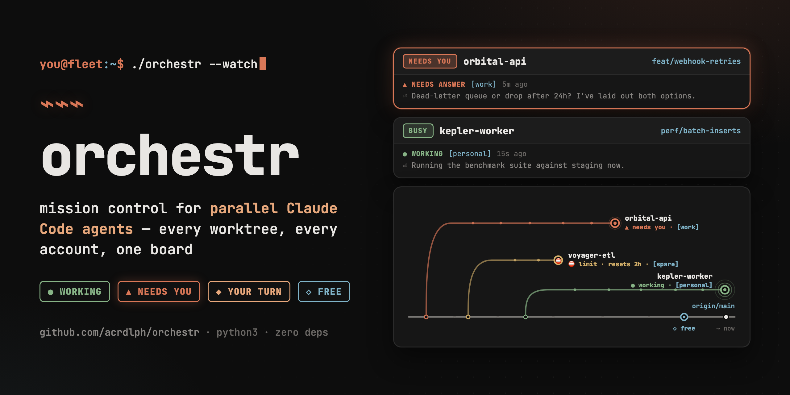
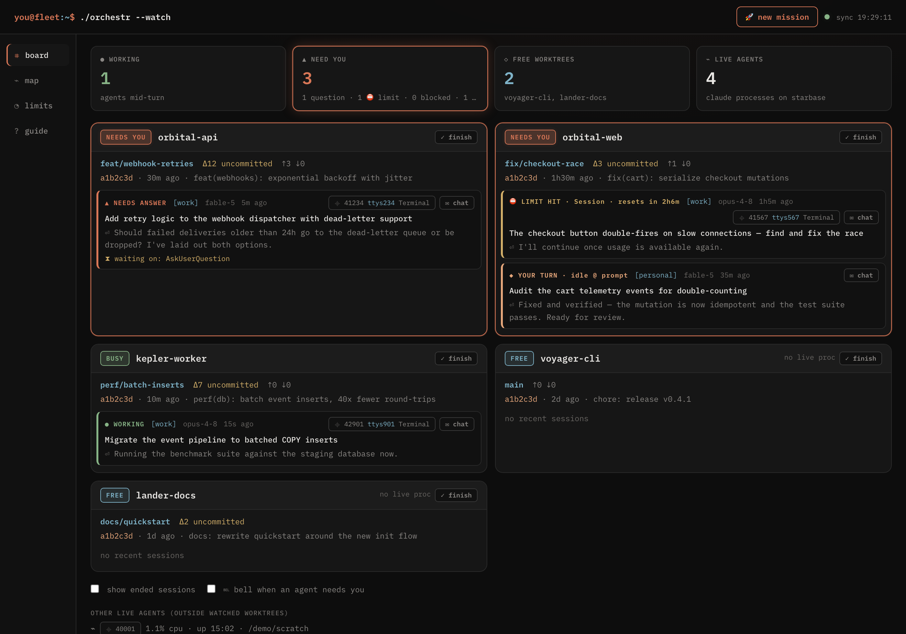
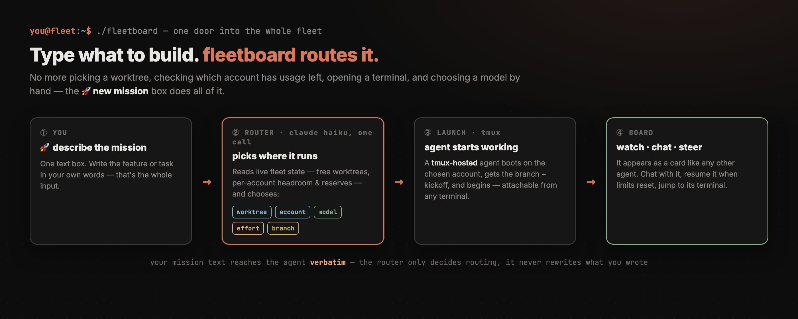
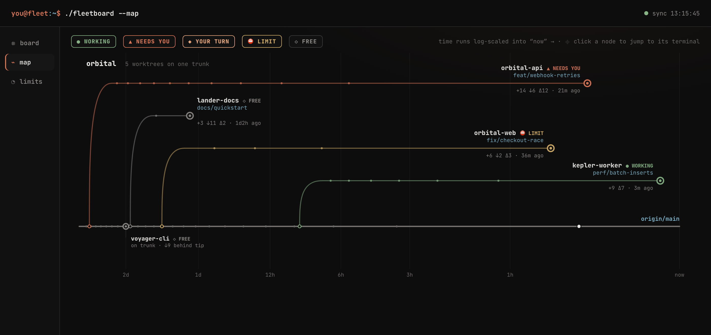
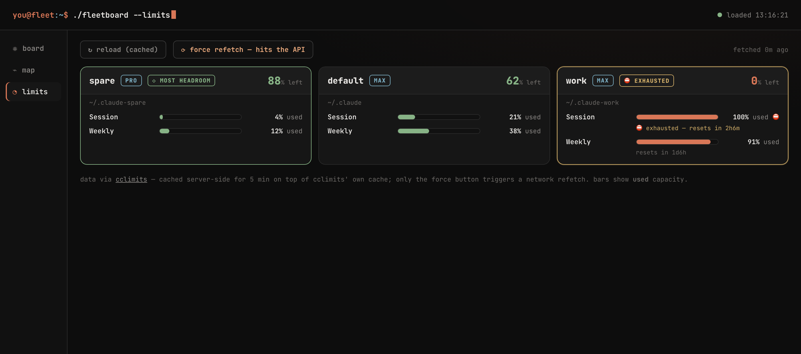
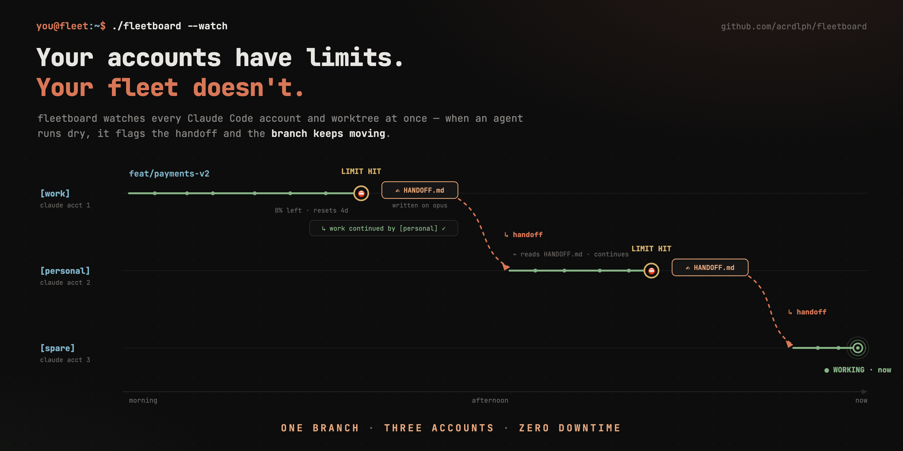
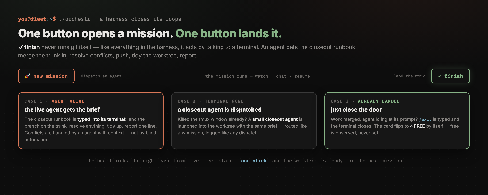

# fleetboard ⌁

[](https://github.com/acrdlph/fleetboard/actions/workflows/ci.yml)

**Mission control for parallel Claude Code agents — watch every worktree and
account on one board, chat with any agent, dispatch new missions, and land
finished ones.**



You're running Claude Code agents in five worktrees at once, across several
accounts. Which agent is working? Which one is waiting for an answer? Which
one silently hit a usage limit an hour ago? Which worktree is free for the
next feature — and on which account? fleetboard answers all of it on one dark
board, and (when you click) acts on it too.

It's an agent **harness** with a hard line down the middle: **watching only
reads** — transcripts, processes, git — and never touches your sessions;
**acting** — chat, resume, dispatch, ✓ finish — happens only on an explicit
click, and always by talking to a terminal, never behind your back. Zero
dependencies — one python3 stdlib file.

```bash
git clone https://github.com/acrdlph/fleetboard && cd fleetboard
python3 fleetboard.py --root ~/code        # → http://127.0.0.1:4242
```

Try it with nothing running: `python3 fleetboard.py --demo` serves fictional
data.

---

## The three views

A left rail navigates between them; all share one visual language:
**green = activity**, **orange = needs you**, **yellow = limit**,
**cyan = free**.

### ⌗ Board — who needs me, and where can I put the next agent?



One card per worktree, attention-sorted, refreshed every 5 s. Each card:
branch, dirty count, ahead/behind, last commit, live processes, and every
recent session tagged with its **account**, model, age, and three lines of
context — `→` the last thing you told it, `⏎` the last thing it said, `⚙` the
latest subagent report. Session statuses:

| badge | meaning |
|---|---|
| `● WORKING` | transcript (or a subagent's) written < 90 s ago |
| `▲ NEEDS ANSWER` | live process with a pending question for you |
| `⛔ LIMIT HIT` | parked on an exhausted account — binding limit + reset countdown shown |
| `■ BLOCKED` | live process stuck on an unresolved tool call |
| `◆ YOUR TURN` | live process idle at the prompt — the turn is finished |
| `○ ENDED` | recent transcript, but no live process behind it |

The header names the **FREE worktrees** — no live process, nothing mid-turn —
so "where do I point the next agent?" is answered before you ask.

**Lost the window an agent runs in?** Every process chip shows its tty and
hosting app (`⌖ 38627 ttys024 Terminal`); click it and that window jumps to
the front (AppleScript for Terminal.app/iTerm2; editors get activated with a
pointer to the tty; tmux agents get the attach command).

**One door into the fleet — the 🚀 new mission button.** Instead of picking a
worktree, checking which account has usage left, opening a terminal, and
choosing a model by hand, you type what to build and fleetboard routes it:



(Details in [Acting on the fleet](#acting-on-the-fleet) below.)

### ⌁ Map — where every branch really is



One trunk per repo (`origin/main`), and every worktree placed at its true git
position: branches leave the trunk at their real merge-base and run to their
tip on a **log time scale ending at "now"**; worktrees whose HEAD sits on main
ride the trunk at the exact commit they're parked on. A tip short of the right
edge is a branch that stopped moving; a long flat arc `↓137` behind is rebase
debt as literal distance. Dots are commits, tips take live status colors (a
working agent's tip pulses), hover for details, click a node for actions
(⌖ focus its terminal · ✓ finish the mission).

### ◔ Limits — is the agent stuck, or out of juice?



Every account side by side via [cclimits](https://github.com/acrdlph/cclimits):
headroom, per-limit usage bars, reset countdowns, ⛔ EXHAUSTED flags, and a
◇ MOST HEADROOM pick for your next agent. Exhausted accounts also feed back
into the board: their parked sessions flip to `⛔ LIMIT HIT` instead of
masquerading as "your turn" (the CLI's "out of usage credits" transcript
notice is a cache-independent fallback signal).

**Polling discipline:** limits are cached server-side for 5 minutes on top of
cclimits' own cache; a network refetch happens **only** when you click "force
refetch". Nothing polls the Anthropic API on a timer.

---

## Acting on the fleet

- **✉ chat** — every session opens a drawer: the conversation is read from
  the transcript; your reply is typed straight into the agent's terminal
  (tmux `send-keys`; AppleScript for Terminal.app/iTerm2 — grant the
  Automation permission when macOS asks; editor-embedded terminals are
  read-only). No more hunting windows to answer an agent.
- **▶ resume** — a session-limit-stuck agent gets a button with a live
  countdown that **arms itself the moment the limit resets**, then types
  `continue`. Weekly limits never show it — they won't heal soon.
- **✓ finish** — one click hands closeout to an agent: the live one gets a
  closeout brief (land the branch, tidy up, report), a missing one is
  replaced by a freshly dispatched closeout agent, and an idle agent whose
  work already landed just gets `/exit`. See *Closing out a mission* below.
- **🚀 new mission** — describe a feature; fleetboard picks the cleanest free
  worktree and the most-headroom account (or a one-shot
  `claude -p --model haiku` router picks them, plus a branch name), then
  launches a tmux-hosted agent: `tmux -L fleet attach -t mission-…` from any
  terminal, and it appears on the board like any other agent. **Your mission
  text is never rewritten** — the router only makes routing decisions; the
  agent receives a deterministic operational header (branch, commit
  discipline) followed by the author's words verbatim. Every dispatch is
  logged to `dispatch.log.jsonl` (gitignored) for auditing.
  **Model & effort** are selectable (or "auto": the router matches them to the
  mission — ultracode for hard features, xhigh for research, high for simple
  tasks — and avoids models whose model-scoped limit is exhausted on the
  chosen account). Picking a specific model checks that model's *own* limit
  per account (Fable can be gone while the weekly limit is fine); if no
  account clears its reserve buffer for it, the dispatch pauses with a dialog
  offering **Opus** instead (or use it anyway) rather than launching blindly.
  Model is a launch flag; effort is typed as `/effort <level>`
  into the new session and **verified** via capture-pane (⚠ shown if
  unconfirmed). Caveat: the CLI saves non-ultracode effort levels as that
  account's default for new sessions — dispatching with an explicit effort
  updates that account's default too.

### Handoffs across accounts

The pattern that makes a multi-account fleet work:



An agent burns its account down, writes a handoff doc (drop to a cheaper model
for that), and an agent on a different account picks the branch up. fleetboard
understands the succession: a limit-hit session with a fresher live session in
its worktree is annotated **"↳ work continued by [account] — this terminal can
be closed"**, leaves the need-you counts, and stops speaking for the branch on
the map. Only a stranded agent with *no* successor keeps demanding attention.

### Closing out a mission

One button: **✓ finish**, on every worktree card and in a map node's panel.
It arms on the first click, runs on the second, and — like everything
fleetboard does — works by talking to a terminal:



- **agent alive** → it receives a closeout brief: land the branch on the
  trunk (merge, resolve, push), tidy the worktree, report back. ✓ finish
  again once it's done closes the terminal.
- **terminal already gone** → a small closeout agent is dispatched into the
  worktree to do the same.
- **everything landed, agent idle** → `/exit` is typed and the terminal
  closes.

Then wait a few seconds: the session flips to `○ ENDED` and the card returns
to `◇ FREE` by itself — free is observed (no live process, no fresh
transcript writes), never set by hand.

The board serves the full operating manual at **`/guide`** — status
vocabulary, mission lifecycle, what the closeout brief asks the agent to do,
and the gotchas.

---

## Setup

**Requirements:** python3 (stdlib only) and `git`. macOS gets full terminal
integration (focus/typing via AppleScript); Linux gets everything except
that, with `/proc`-based process detection. Optional: `tmux` (dispatch),
[cclimits](https://github.com/acrdlph/cclimits) (limits view),
`claude` on PATH (dispatch router).

```bash
python3 fleetboard.py [--root DIR]... [--pattern REGEX] [--home DIR]...
                      [--port N] [--window-h H] [--demo]
./start.sh            # restart + open browser (extra args passed through)
```

| flag | default | meaning |
|---|---|---|
| `--root DIR` | cwd | directory whose git-repo children are watched (repeatable) |
| `--pattern REGEX` | all | only watch child dirs matching this (case-insensitive) |
| `--home DIR` | auto | Claude home dirs; default finds `~/.claude*` |
| `--port N` | 4242 | also `FLEETBOARD_PORT` env |
| `--window-h H` | 48 | ignore transcripts idle longer than this many hours |
| `--demo` | — | fictional data (screenshots, kicking the tires) |

Persistent settings go in `fleetboard.config.json` next to the script
(gitignored):

```json
{ "roots": ["/Users/you/code"], "pattern": "myproject", "cclimits_cmd": null,
  "exclude_accounts": [], "router_home": null, "reserve_percent": {"main": 20} }
```

`exclude_accounts` names accounts (by label) that dispatch/router will never
**auto**-pick — useful for keeping a primary account (e.g. `main` = `~/.claude`)
out of automated launches so a stale token there can't hijack a browser login.
`router_home` pins the one-shot haiku router to a single known-good Claude home
instead of rotating across accounts. `reserve_percent` keeps a headroom buffer
free per account (`{"main": 20}` = never auto-dispatch onto `main` once it drops
below 20% left; `"*"` sets a default for all). The router is told which accounts
are reserve-blocked and treats them as full. Manual selection can still target
any account.

Worktrees are discovered as immediate children of each root that are git
repositories (a `<dir>/repo` layout is also recognized).

**Multi-account setups** follow the cclimits conventions: any `~/.claude` or
`~/.claude-*` directory containing `projects/` is auto-discovered and named
after its suffix (`~/.claude-work` → `work`, bare `~/.claude` → `main`).
Non-standard locations: `--home DIR`, the config file's `"homes"`, or a
colon-separated `CLAUDE_CONFIG_DIRS`. See the cclimits README for setting up
accounts via `CLAUDE_CONFIG_DIR`.

---

## How it works

- **Sessions** — tail-parses the last 128 KB of each
  `<claude-home>/projects/<munged-cwd>/*.jsonl` transcript, skipping subagent
  sidechains; topics come from the compaction summary or first real prompt,
  with slash-command stubs, ANSI noise, and harness chatter filtered out.
- **Subagents & workflows** — a session running a Workflow writes to
  `<session-id>/**/*.jsonl` while its main transcript sits untouched;
  fleetboard counts that activity toward liveness (⚙ indicator) and surfaces
  the newest subagent report, so multi-agent sessions never misreport as idle.
- **Liveness** — `ps` for `claude` processes, cwds via one `lsof` call
  (macOS/BSD) or `/proc/<pid>/cwd` (Linux). N live processes under a worktree
  vouch for its N freshest sessions; everything staler is ENDED, so dead
  transcripts can't masquerade as waiting agents.
- **Mapping** — transcript project dirs match worktrees by munged-path
  prefix, longest prefix wins (`myapp` doesn't swallow `myapp-audit`).
- **Terminal actuation** — tmux targets are resolved by walking process
  ancestry to the owning pane; Terminal.app/iTerm2 tabs are matched by tty.

## Tests

Pure stdlib `unittest`, zero dependencies — same as the app:

```bash
python3 -m unittest discover -s tests     # from the repo root
```

**Unit tests** (`tests/test_fleetboard.py`) cover the logic that's easy to get
wrong: transcript text cleaning and the real-vs-machine prompt filter, account
labelling, longest-prefix worktree matching, session-status classification
(working / needs-input / limit / blocked / your-turn / ended), per-model
headroom + reserve buffers, the reserve-persist round-trip, dispatch-log
parsing, and an HTTP smoke test that boots the real server in `--demo` mode
and hits every endpoint.

**Integration tests** (`tests/test_integration.py`) exercise the *real*
pipeline against controlled fixtures — no dependency on your live fleet:

- a temp **git repo** + a temp **Claude home** with real `.jsonl` transcripts,
  run through the actual `discover_worktrees` → `git_info` → `scan_sessions` →
  `collect_state` path (branch, dirty count, topic extraction, fresh-vs-ended
  status, pending-workflow reporting). Live-system inputs (`ps`/`lsof`,
  `cclimits`) are stubbed to empty so the git + transcript code runs for real.
- `branch_topology` against a repo with a real `origin/main` ref (fork point,
  ahead/behind).
- the **tmux actuation** layer (`send-keys` + `capture-pane`) that dispatch,
  chat, resume, and effort-verification depend on — on its own socket, with a
  plain shell, never launching `claude`.

Tests self-skip where a tool is missing (`git`, `tmux`). What stays manual:
the real `claude`/`cclimits`/AppleScript calls — verified by driving a live
dispatch (kickoff → READY → instruction → DONE).

## Security & spending

- **The board serves your prompts and your agents' replies.** It binds to
  127.0.0.1 and should stay there; a warning prints if you bind wider.
- **Actions type into your terminals.** Chat/resume literally keystroke the
  target terminal — same as you typing. They fire only on your click.
- **Dispatch spends usage.** A launched agent runs
  `--dangerously-skip-permissions` (nobody is at its prompt to approve
  tools), and the optional router is one extra `claude -p` haiku call.
  Nothing launches, resumes, or refetches limits on its own.

## Caveats

- The transcript format is an undocumented Claude Code internal (tested
  against v2.1.x); statuses are honest heuristics, not ground truth.
- BLOCKED / YOUR TURN are inferred — permission prompts aren't recorded in
  transcripts.
- Each clone's `origin/main` is only as fresh as its last `git fetch`; the
  map's trunk uses the freshest clone's view.
- Handoff detection reads "fresher live session in the same worktree" as
  succession — starting unrelated new work next to a limit-parked agent will
  be labeled a handoff.

## License

[MIT](LICENSE)
