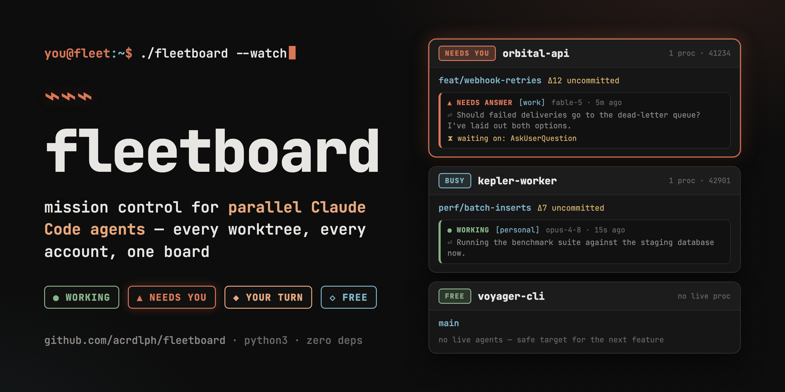

# fleetboard ⌁

**Local mission control for parallel Claude Code agents.**

You're running Claude Code agents in five worktrees at once — maybe across
several accounts. Which agent is working? Which one is stuck waiting for an
answer? Which worktree is free for the next feature? fleetboard puts it on one
board.



It's a **read-only observer**: it never launches, wraps, or touches your
sessions. Point it at your existing chaos and it reports. Zero dependencies —
one python3 stdlib file.

```bash
git clone https://github.com/acrdlph/fleetboard && cd fleetboard
python3 fleetboard.py --root ~/code        # then open http://127.0.0.1:4242
```

## What it answers

- **Which worktree is free?** The header tile names worktrees with no live
  `claude` process and nothing mid-turn — safe targets for the next agent.
- **Who needs me right now?** Cards sort attention-first. Per session:

  | badge | meaning |
  |---|---|
  | `● WORKING` | transcript written < 90 s ago |
  | `▲ NEEDS ANSWER` | live process with a pending question for you |
  | `■ BLOCKED` | live process stuck on an unresolved tool call (permission prompt?) |
  | `◆ YOUR TURN` | live process idle at the prompt — the turn is finished |
  | `○ ENDED` | recent transcript, but no live process behind it |

- **What is each one doing?** Branch, dirty file count, ahead/behind upstream,
  last commit, each session's opening prompt, and the agent's last words.
- **Which account is where?** Multi-account setups (`~/.claude`,
  `~/.claude-work`, `~/.claude-account2`, …) are auto-discovered; each session
  is tagged with its account.

## Multi-account setups

fleetboard follows the same conventions as its companion tool
[cclimits](https://github.com/acrdlph/cclimits) (usage limits across accounts
in one table — see its README for how to set up multiple accounts via
`CLAUDE_CONFIG_DIR`):

1. **Auto-discovery** — any `~/.claude` or `~/.claude-*` directory containing
   `projects/` is picked up; the account is named after the dir suffix, so
   `~/.claude-work` shows as `work` (bare `~/.claude` shows as `main`).
2. **Non-standard locations** — pass `--home DIR` (repeatable), set `"homes"`
   in the config file, or export `CLAUDE_CONFIG_DIRS` as a colon-separated
   list, exactly as cclimits does.

The page auto-refreshes every 5 s (collectors are cached at 4 s so the browser
can't hammer git/lsof), flags the tab title with `(N!)` when agents need you,
and can optionally ring a terminal bell.

The board itself (`--demo` data):


## Usage

```bash
python3 fleetboard.py [--root DIR]... [--pattern REGEX] [--home DIR]...
                      [--port N] [--window-h H] [--demo]
./start.sh            # restart + open browser (extra args passed through)
```

| flag | default | meaning |
|---|---|---|
| `--root DIR` | cwd | directory whose git-repo children are watched (repeatable) |
| `--pattern REGEX` | all | only watch child dirs matching this (case-insensitive) |
| `--home DIR` | auto | Claude home dirs; default finds `~/.claude*` |
| `--port N` | 4242 | also `FLEETBOARD_PORT` env |
| `--window-h H` | 48 | ignore transcripts idle longer than this |
| `--demo` | — | serve fictional data (screenshots, kicking the tires) |

Persistent settings go in a `fleetboard.config.json` next to the script
(gitignored — see `.gitignore`):

```json
{ "roots": ["/Users/you/code"], "pattern": "myproject" }
```

Worktrees are discovered as immediate children of each root that are git
repositories; a `<dir>/repo` checkout layout is also recognized.

## How it works

- **Sessions** — tail-parses the last 128 KB of each
  `<claude-home>/projects/<munged-cwd>/*.jsonl` transcript, skipping subagent
  sidechains. The topic is the compaction summary or the first real user
  prompt; slash-command stubs and ANSI noise are filtered out.
- **Liveness** — `ps` for `claude` processes, then their cwds via one `lsof`
  call (macOS/BSD) or `/proc/<pid>/cwd` (Linux). A live process vouches for at
  most one session per directory (freshest first), so stale transcripts don't
  masquerade as waiting agents.
- **Mapping** — transcript project dirs are matched to worktrees by munged
  path prefix, longest prefix wins (so `myapp` doesn't swallow
  `myapp-security-audit`).

## Caveats

- The transcript format is an undocumented Claude Code internal (tested
  against v2.1.x) — a CLI update can break parsing. Statuses are heuristics:
  transcripts don't record permission prompts explicitly, so BLOCKED /
  YOUR TURN are inferred.
- **The board serves your prompts and your agents' replies.** It binds to
  127.0.0.1 by default; don't expose it to the network.
- Usage/limit tracking is deliberately out of scope — that's what
  [cclimits](https://github.com/acrdlph/cclimits) is for (and the limits API
  shouldn't be polled every 5 s) — though an agent announcing "you've hit your
  weekly limit" shows up in its last-words snippet anyway.

## License

[MIT](LICENSE)
